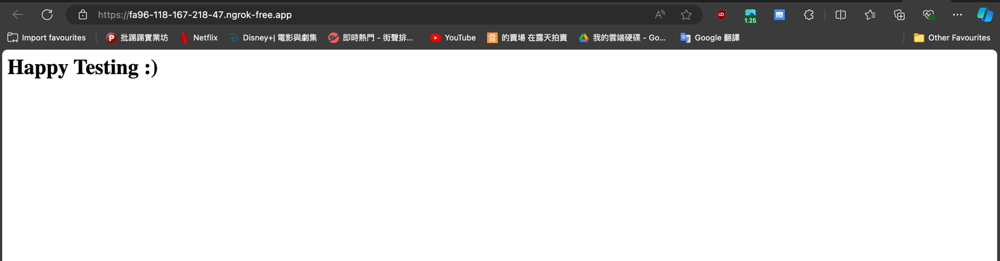

# Flask + Docker + Ngrok Practice

## Purpose
Build a simple webhook / website, practice how to use ...
1. Poetry
2. Flask
3. Docker
4. Ngrok

## Operation
### Poetry env setup
- When the project start from 0 to 1
```commandline
$ poetry init # Enter No, No, Yes
$ poetry env use /PATH/flask_docker_ngrok_practice/.venv
$ poetry shell 
$ poetry add xxx # Package name e.g. poetry add flask
$ poetry lock  # Lock file sync with toml
$ poetry export -f requirements.txt -o requirements.txt --without-hashes # Optional if need export requirements.txt
```

- When clone the repo from others
```commandline
$ poetry install
$ poetry shell
```

### Coding
Coding ... ...

### Build Docker image
```commandline
$ docker build -t flask_docker_ngrok_practice:latest . 
```

### Ngrok config in Docker
https://dashboard.ngrok.com/get-started/setup/macos
```commandline
$ docker run -p 5001:5001 --name custom_name_flask flask_docker_ngrok_practice:latest
$ docker exec -it custom_name_flask /bin/sh
$ ngrok config add-authtoken {YOUR_TOKEN}
```

### After all done then build up the webhook / website
```commandline
$ docker start custom_name_flask
$ docker exec -it custom_name_flask /bin/sh
$ ngrok http 5001
```


### If the code changed
```commandline
$ docker-compose up -d
```

#### Happy Testing
https://2d04-118-167-218-47.ngrok-free.app/



